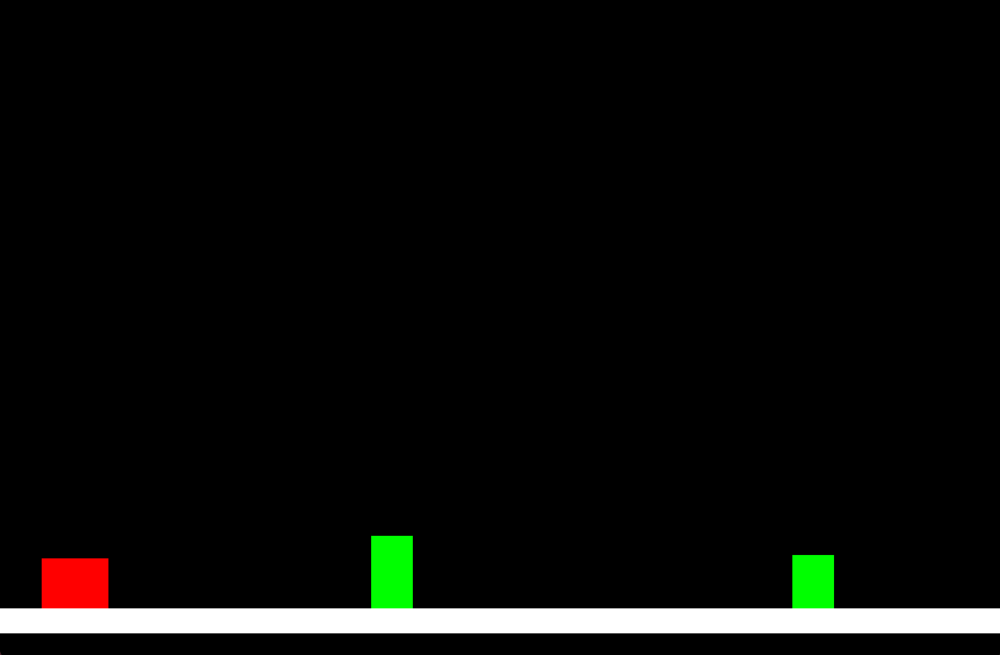

# DinoRun: A Simple 2D Platformer Game

DinoRun is a fun and addictive 2D platformer game inspired by Google's offline dinosaur game. As the player, you control a dinosaur that must jump over 
obstacles to avoid collisions.

## Features

* **Player-Controlled Jumping Mechanics**: Jump your way through procedurally generated obstacles with intuitive controls.
* **Procedurally Generated Obstacles**: A new challenge awaits around every corner, keeping gameplay fresh and exciting.
* **Collision Detection**: Don't get caught - our game accurately detects collisions to ensure a seamless experience.
* **Game Over Logic**: When an obstacle is hit, the game ends. Challenge yourself to beat your high score!

## Getting Started

### Prerequisites

To run DinoRun, you'll need:

* C++11 or later
* The [SDL2 Library](https://www.libsdl.org/download-2.0.php) installed on your system

### Installing SDL2

#### On Linux
Use your package manager to install SDL2:
```bash
sudo apt-get install libsdl2-dev
```

#### On MacOS
Install SDL2 using Homebrew:
```bash
brew install sdl2
```

#### On Windows
Download the SDL2 development libraries from the official website and follow the setup instructions for your compiler/IDE (Visual Studio, MinGW, etc.).

## Cloning and Compiling DinoRun

1. Clone the repository:
```bash
git clone https://github.com/Uglypr1nces/DinoRun.git
cd DinoRun
```

2. Compile the game:
**Linux/MacOS:**
```bash
g++ -o DinoRun main.cpp -lSDL2
```
**Windows:**
```bash
g++ -o DinoRun.exe main.cpp -lmingw32 -lSDL2main -lSDL2
```

3. Run the game:
```bash
./DinoRun (Linux/MacOS)
./DinoRun.exe (Windows)
```

## Contributing

We welcome contributions to improve and expand upon DinoRun! Whether it's adding new features, fixing bugs, or optimizing performance, your help is greatly 
appreciated.

## Screenshots


